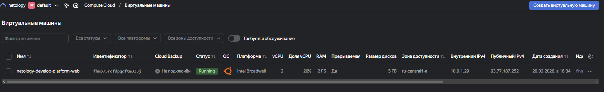
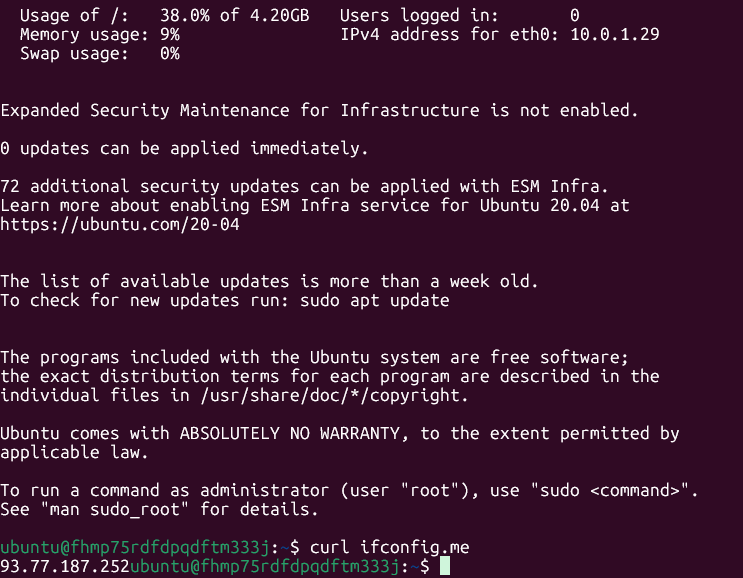
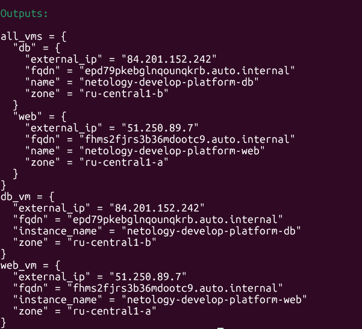

---

Задание 1  

preemptible = true (прерываемая ВМ) - Экономия бюджета - Идеально для учебных сценариев  
core\_fraction = 5 (гарантированная доля CPU) - Минимальные затраты при достаточной производительности - Возможность запускать больше ВМ  
  

  

  
---
  
Задание 4  
  

  
PS: Весь код для 1-6 задания представлен в файлах.  
  
---